# CTOMS-LR ERD (Entity Relationship Diagram)

This ERD shows the primary entities for CTOMS-LR and the relationships between them. The diagram uses Mermaid `erDiagram` notation. A clear legend is included so the arrow types and cardinalities are obvious to a human reader.

**Progress:** Created ERD file with legend and diagram.

---

## Legend — Arrow types and meanings

- `||` = exactly one (1)
- `|o` = zero or one (0..1)
- `}|` = one or many notation (many side marker)
- `o{` = zero or many (0..*)

Human-friendly arrow examples (read left → right):

- `USER ||--o{ ORDER : places`  → A `USER` places zero or many `ORDER`s; each `ORDER` belongs to exactly one `USER`.
- `SHOP ||--o{ ORDER : has`     → A `SHOP` has zero or many `ORDER`s; each `ORDER` belongs to exactly one `SHOP`.
- `ORDER }|--|{ ORDER_ITEM : contains` → Each `ORDER` contains one or many `ORDER_ITEM`s; each `ORDER_ITEM` belongs to one `ORDER`.
- `ORDER }|--o{ ORDER_ASSIGNMENT : assigned` → Each `ORDER` may be assigned to many users via pivot; assignment rows map to users.

(Use the Mermaid rendering to see the arrows visually.)

---

## Entity Definitions (brief)

- `users` — application users (admins, owners, staff)
- `user_roles` — role assignments per user (polymorphic or simple mapping)
- `tailoring_shops` — shops owned by shop owners
- `shop_staff` — pivot mapping users to shops with `is_active` flag
- `orders` — customer orders
- `order_assignments` — pivot mapping staff users to orders (SSOT)
- `order_items` — individual items on an order
- `appointments` — schedule entries linked to orders and shops
- `shop_schedules` — recurring shop hours
- `inventory` — shop inventory / shop attributes
- `customers` — customer profile linked to orders

---

## ERD (Mermaid)

```mermaid
erDiagram
    %% Core application tables
    USERS {
        bigint id PK
        string name
        string email
    }

    USERS_PROFILE {
        bigint id PK
        bigint user_id FK
        string avatar_url
    }

    USER_MEASUREMENTS {
        bigint id PK
        bigint user_id FK
        string measurement_name
        float value
    }

    USER_ROLES {
        bigint id PK
        bigint user_id FK
        string role
    }

    PERSONAL_ACCESS_TOKENS {
        bigint id PK
        bigint tokenable_id FK
        string token
    }

    %% Shop / Store tables
    TAILORING_SHOPS {
        bigint id PK
        string shop_name
        bigint owner_id FK
    }

    SHOP_STATUSSES {
        bigint id PK
        string name
    }

    SHOP_DOCUMENTS {
        bigint id PK
        bigint shop_id FK
        string document_type
    }

    SHOP_STAFF {
        bigint id PK
        bigint shop_id FK
        bigint user_id FK
        boolean is_active
    }

    SHOP_SCHEDULES {
        bigint id PK
        bigint shop_id FK
        string day_of_week
        time open_time
        time close_time
    }

    SHOP_EXCEPTIONS {
        bigint id PK
        bigint shop_id FK
        date date
        boolean is_closed
    }

    HOLIDAYS {
        bigint id PK
        date date
        string reason
    }

    %% Products, services and attributes
    SERVICE_CATEGORIES {
        bigint id PK
        string name
    }

    SERVICES {
        bigint id PK
        bigint category_id FK
        string name
        decimal price
    }

    ATTRIBUTE_CATEGORIES {
        bigint id PK
        string name
    }

    ATTRIBUTE_TYPES {
        bigint id PK
        bigint category_id FK
        string name
    }

    SHOP_ATTRIBUTES {
        bigint id PK
        bigint shop_id FK
        bigint attribute_type_id FK
        int stock_quantity
    }

    INVENTORY {
        bigint id PK
        bigint shop_id FK
        string item_name
        int quantity
    }

    %% Orders & related
    CUSTOMERS {
        bigint id PK
        string name
        string email
    }

    ORDERS {
        bigint id PK
        string order_number
        bigint shop_id FK
        bigint customer_id FK
        bigint status_id FK
        datetime expected_completion_date
    }

    ORDER_ITEMS {
        bigint id PK
        bigint order_id FK
        string item_name
        int quantity
    }

    ORDER_MEASUREMENTS {
        bigint id PK
        bigint order_id FK
        string measurement_name
        float value
    }

    ORDER_PHOTOS {
        bigint id PK
        bigint order_id FK
        string url
    }

    ORDER_REWORKS {
        bigint id PK
        bigint order_id FK
        string reason
    }

    ORDER_SERVICES {
        bigint id PK
        bigint order_id FK
        bigint service_id FK
    }

    ORDER_STATUSES {
        bigint id PK
        string name
    }

    ORDER_ASSIGNMENTS {
        bigint id PK
        bigint order_id FK
        bigint user_id FK
        datetime assigned_at
    }

    ORDER_LOGS {
        bigint id PK
        bigint order_id FK
        string message
    }

    PAYMENTS {
        bigint id PK
        bigint order_id FK
        decimal amount
        bigint payment_status_id FK
    }

    PAYMENT_STATUSES {
        bigint id PK
        string name
    }

    PAYMENT_TYPES {
        bigint id PK
        string name
    }

    REPORTS {
        bigint id PK
        string name
        bigint order_id FK
    }

    NOTIFICATIONS {
        bigint id PK
        bigint notifiable_id
        string type
        text data
    }

    APPOINTMENTS {
        bigint id PK
        bigint order_id FK
        bigint shop_id FK
        date date
        time time_start
    }

    %% System tables
    CACHE {
        bigint id PK
        string key
    }

    CACHE_LOCKS {
        bigint id PK
    }

    JOBS {
        bigint id PK
    }

    JOB_BATCHES {
        bigint id PK
    }

    FAILED_JOBS {
        bigint id PK
    }

    SESSIONS {
        bigint id PK
    }

    PERSONAL_ACCESS_TOKENS {
        bigint id PK
    }

    %% Relationships (cardinalities)
    USERS ||--o{ USER_ROLES : "has roles"
    USERS ||--o{ USERS_PROFILE : "profile"
    USERS ||--o{ USER_MEASUREMENTS : "measurements"
    USERS ||--o{ SHOP_STAFF : "works at (pivot)"
    USERS ||--o{ ORDER_ASSIGNMENTS : "assigned to (pivot)"

    TAILORING_SHOPS ||--o{ SHOP_STAFF : "has staff"
    TAILORING_SHOPS ||--o{ ORDERS : "has orders"
    TAILORING_SHOPS ||--o{ SHOP_SCHEDULES : "schedules"
    TAILORING_SHOPS ||--o{ SHOP_EXCEPTIONS : "exceptions"
    TAILORING_SHOPS ||--o{ SHOP_DOCUMENTS : "documents"
    TAILORING_SHOPS ||--o{ APPOINTMENTS : "appointments"
    TAILORING_SHOPS ||--o{ INVENTORY : "inventory"

    SERVICE_CATEGORIES ||--o{ SERVICES : "contains"
    SERVICES ||--o{ ORDER_SERVICES : "used by orders"

    CUSTOMERS ||--o{ ORDERS : "places"
    ORDERS ||--o{ ORDER_ITEMS : "contains"
    ORDERS ||--o{ ORDER_MEASUREMENTS : "measurements"
    ORDERS ||--o{ ORDER_PHOTOS : "photos"
    ORDERS ||--o{ ORDER_REWORKS : "reworks"
    ORDERS ||--o{ ORDER_SERVICES : "services"
    ORDERS ||--o{ ORDER_ASSIGNMENTS : "assignments"
    ORDERS ||--o{ ORDER_LOGS : "logs"
    ORDERS ||--o{ PAYMENTS : "payments"
    ORDERS ||--o{ APPOINTMENTS : "appointments"

    ORDER_ASSIGNMENTS }|--|| USERS : "assigned_user"
    SHOP_STAFF }|--|| USERS : "staff_user"

    ORDERS }|--|| TAILORING_SHOPS : "shop"
    ORDERS }|--|| CUSTOMERS : "customer"
    ORDERS }|--|| ORDER_STATUSES : "status"
    PAYMENTS }|--|| PAYMENT_STATUSES : "payment_status"

    %% System relations (simplified)
    JOBS ||--o{ JOB_BATCHES : "batch"

```

---

## Human-readable cardinality table

- `||--||` : One-to-one
- `||--o{` : One-to-zero-or-many
- `}|--||` : Many-to-one
- `}|--o{` : Many-to-many (through pivot table)

---

## Notes and next steps

- The `order_assignments` pivot is the single source of truth (SSOT) for staff assignments.
- If you'd like a PNG/SVG export, I can generate and add it to the repo (requires Mermaid CLI or external renderer).

---

*File created: ERD_DIAGRAM.md — May 15, 2026*
