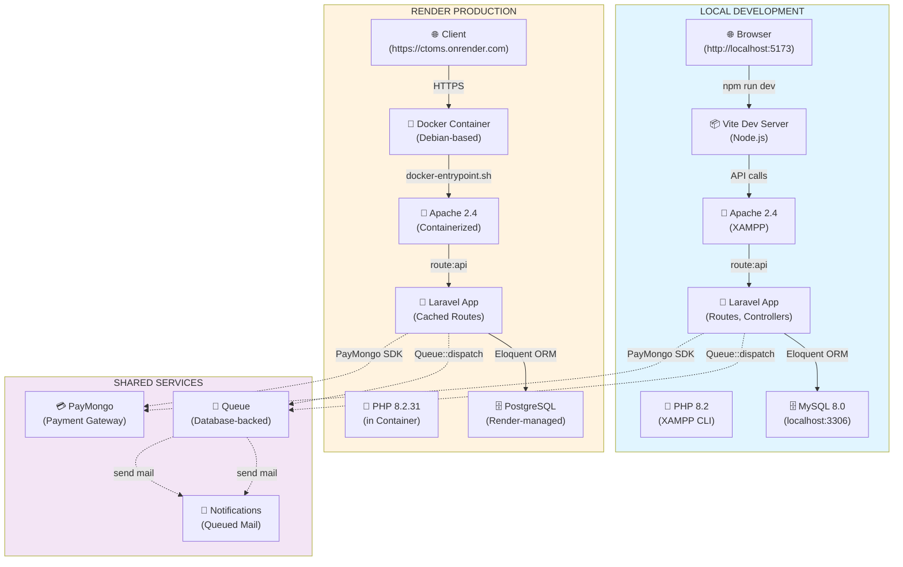
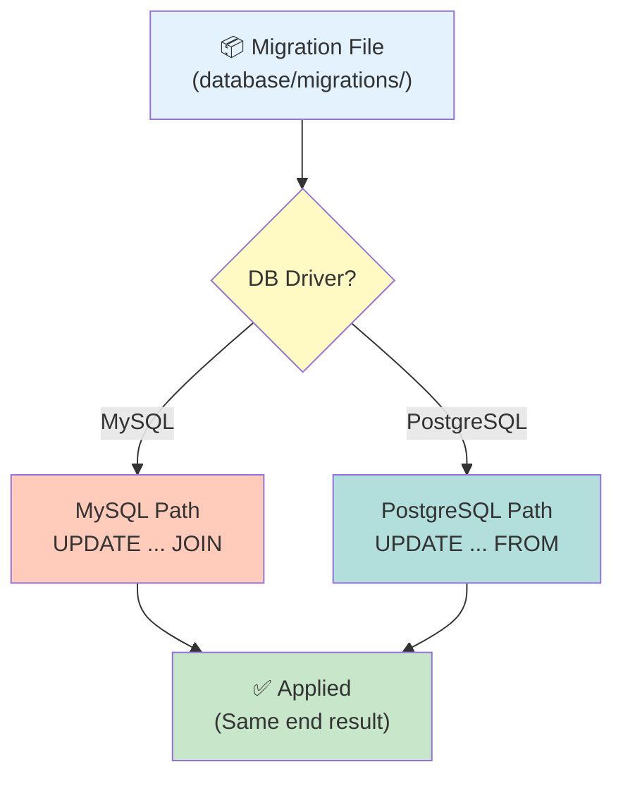

# Hybrid Topology Architecture Guide - Stitch Central (CTOMS)

## Overview

Your application follows a **Hybrid Cloud Architecture** pattern, combining local development and cloud production environments with abstraction layers to maintain consistency across deployment contexts.

---

## 1. What is Hybrid Topology?

**Hybrid topology** means your system spans multiple deployment environments with different infrastructure characteristics but maintains functional equivalence through:

- **Environment abstraction** — Code works locally (MySQL + Apache) and in cloud (PostgreSQL + Docker)
- **Database compatibility** — Migrations use conditional logic (`DB::getDriverName()`) to support both MySQL and PostgreSQL
- **Deployment parity** — Frontend builds identically; backend configuration adapts via environment variables
- **Scalability** — Local is single-server; Render is containerized and auto-scaling capable

---

## 2. Topology Map Overview

```
┌─────────────────────────────────────────────────────────────────┐
│                         HYBRID TOPOLOGY                          │
├─────────────────────────────────────────────────────────────────┤
│                                                                  │
│  LOCAL DEVELOPMENT              RENDER PRODUCTION               │
│  ==================             ====================            │
│                                                                  │
│  ┌──────────────────┐           ┌──────────────────┐           │
│  │  Developer PC    │           │  Render Platform │           │
│  │  (Windows/Mac)   │           │  (Container)     │           │
│  └────────┬─────────┘           └────────┬─────────┘           │
│           │                               │                     │
│  ┌────────▼──────────────┐      ┌────────▼──────────────┐      │
│  │  XAMPP Stack          │      │  Docker Container     │      │
│  ├───────────────────────┤      ├───────────────────────┤      │
│  │ • Apache 2.4          │      │ • Apache 2.4 (Debian) │      │
│  │ • PHP 8.2 (CLI)       │      │ • PHP 8.2.31          │      │
│  │ • MySQL 8.0           │      │ • PostgreSQL (extern) │      │
│  │ • Composer            │      │ • Composer (built)    │      │
│  └────────┬──────────────┘      └────────┬──────────────┘      │
│           │                               │                     │
│  ┌────────▼──────────────┐      ┌────────▼──────────────┐      │
│  │  Laravel App          │      │  Laravel App          │      │
│  │  (Port 8000/80)       │      │  (PORT env var)       │      │
│  ├───────────────────────┤      ├───────────────────────┤      │
│  │ • Routes              │      │ • Routes (cached)     │      │
│  │ • Controllers         │      │ • Config (cached)     │      │
│  │ • Migrations (MySQL)  │      │ • Migrations (PgSQL)  │      │
│  │ • Queue (database)    │      │ • Queue (database)    │      │
│  │ • Notifications       │      │ • Notifications       │      │
│  └────────┬──────────────┘      └────────┬──────────────┘      │
│           │                               │                     │
│  ┌────────▼──────────────┐      ┌────────▼──────────────┐      │
│  │  React Frontend       │      │  React Frontend       │      │
│  │  (Vite Dev Server)    │      │  (Static Assets)      │      │
│  ├───────────────────────┤      ├───────────────────────┤      │
│  │ • Inertia Adapter     │      │ • Inertia Adapter     │      │
│  │ • API calls to :8000  │      │ • API calls via env   │      │
│  │ • Hot reload support  │      │ • (VITE_API_URL)      │      │
│  └───────────────────────┘      └───────────────────────┘      │
│                                                                  │
│           │                              │                      │
│           └──────────┬───────────────────┘                      │
│                      │                                           │
│           ┌──────────▼──────────┐                               │
│           │  Shared Services    │                               │
│           ├─────────────────────┤                               │
│           │ • PayMongo (Gateway)│                               │
│           │ • Storage (public)  │                               │
│           │ • Email (via Queue) │                               │
│           │ • Authentication    │                               │
│           │   (Sanctum)         │                               │
│           └─────────────────────┘                               │
│                                                                  │
└─────────────────────────────────────────────────────────────────┘
```

---

## 3. Component Breakdown

### 3.1 Frontend Layer

| Component | Local | Production | Notes |
|-----------|-------|-----------|-------|
| **Framework** | React 18 + Inertia | React 18 + Inertia | Same codebase |
| **Build Tool** | Vite (dev mode) | Vite (built) | `npm run build` creates `/public/build/` |
| **API URL** | `import.meta.env.VITE_API_URL` \|\| `window.location.origin` | `VITE_API_URL=https://l-r-ctoms.onrender.com` | Env-driven configuration |
| **Port** | 5173 (Vite dev) | 80 (Apache static) | Dev server independent; prod served by Apache |
| **Authentication** | Sanctum (localhost:8000) | Sanctum (l-r-ctoms.onrender.com) | CORS configured for both |

### 3.2 Backend Layer

| Component | Local | Production | Notes |
|-----------|-------|-----------|-------|
| **Framework** | Laravel 12 + PHP 8.2 | Laravel 12 + PHP 8.2 | Same codebase |
| **Web Server** | Apache 2.4 (XAMPP) | Apache 2.4 (Docker) | Both use mod_rewrite |
| **Port** | 8000 (default) | Dynamic (Render `$PORT`) | Dockerfile binds to env var |
| **Document Root** | `/xampp/htdocs/CTOMS-LR/public` | `/var/www/html/public` | Same structure |
| **Route Caching** | Not cached (dev) | Cached in Dockerfile | `php artisan route:cache` |
| **Config Caching** | Not cached (dev) | Cached in Dockerfile | `php artisan config:cache` |

### 3.3 Database Layer

| Component | Local | Production | Notes |
|-----------|-------|-----------|-------|
| **System** | MySQL 8.0 | PostgreSQL (Render-managed) | Different SQL dialects |
| **Connection** | `DB_CONNECTION=mysql` | `DB_CONNECTION=pgsql` | Env-driven selection |
| **Migrations** | All migrations run on MySQL | All migrations run on PostgreSQL (safe) | Migrations use `DB::getDriverName()` conditionals |
| **Host** | `127.0.0.1:3306` | Render PostgreSQL private endpoint | Credentials in Render env vars |
| **Seeding** | Uses `updateOrInsert()` for idempotency | Uses `updateOrInsert()` for idempotency | Prevents duplicate key errors |

### 3.4 Queue & Background Jobs

| Component | Local | Production | Notes |
|-----------|-------|-----------|-------|
| **Queue Driver** | Database | Database | `QUEUE_CONNECTION=database` |
| **Worker** | Manual: `php artisan queue:work` | Render cron or process | Not auto-started in Docker |
| **Notifications** | ShouldQueue mailable | ShouldQueue mailable | Same code; runs when worker active |
| **Storage** | `storage/logs/` | `/var/www/html/storage/logs/` | Persistent in container (ephemeral on Render) |

### 3.5 Authentication & Security

| Component | Local | Production | Notes |
|-----------|-------|-----------|-------|
| **Protocol** | HTTP (dev only) | HTTPS (enforced) | Render auto-redirects |
| **CORS** | `SANCTUM_STATEFUL_DOMAINS=127.0.0.1:8000` | `SANCTUM_STATEFUL_DOMAINS=...l-r-ctoms.onrender.com` | Must include all origins |
| **Session Storage** | Database (session driver) | Database (session driver) | Same across environments |
| **Encryption** | `APP_KEY` (from .env) | `APP_KEY` (Docker generated) | Must be stable for session compatibility |

---

## 4. Data Flow Diagrams

### 4.1 Request Flow (Local Development)

```
┌─────────────────────────────────────────────────────────────────┐
│  User Browser                                                    │
│  (http://127.0.0.1:5173)                                        │
│                                                                  │
└────────────────┬──────────────────────────────────────────────┘
                 │
                 │ 1. React/Vite renders page
                 │    (HMR for hot reload)
                 │
         ┌───────▼────────────────────┐
         │  Vite Dev Server           │
         │  Port 5173                 │
         │  (Node.js)                 │
         └───────┬────────────────────┘
                 │
                 │ 2. API fetch() call
                 │    /api/orders, /api/payments, etc.
                 │
         ┌───────▼────────────────────┐
         │  XAMPP Apache              │
         │  Port 8000 (or 80)         │
         │  Document Root: /public    │
         └───────┬────────────────────┘
                 │
                 │ 3. Route matching
                 │    (routes/api.php, routes/web.php)
                 │
         ┌───────▼────────────────────┐
         │  Laravel Routing Engine    │
         │  (kernel middleware stack) │
         └───────┬────────────────────┘
                 │
                 │ 4. Route → Controller
                 │ e.g., OrderController@store()
                 │
         ┌───────▼────────────────────┐
         │  Business Logic Layer      │
         │  (Controllers, Services)   │
         └───────┬────────────────────┘
                 │
                 │ 5. Data access
                 │    (Eloquent ORM)
                 │
         ┌───────▼────────────────────┐
         │  MySQL Database            │
         │  (Connection: 127.0.0.1)   │
         │  (Port: 3306)              │
         └────────────────────────────┘
```

### 4.2 Request Flow (Production on Render)

```
┌─────────────────────────────────────────────────────────────────┐
│  User Browser / Client                                          │
│  (https://l-r-ctoms.onrender.com)                              │
│                                                                  │
└────────────────┬──────────────────────────────────────────────┘
                 │
                 │ 1. HTTPS request to Render domain
                 │
         ┌───────▼────────────────────────────┐
         │  Render Edge / Reverse Proxy        │
         │  (Auto-handles SSL, load balancing)│
         └───────┬────────────────────────────┘
                 │
                 │ 2. Forward to container
                 │
         ┌───────▼────────────────────────────┐
         │  Docker Container                   │
         │  (From Dockerfile)                  │
         └───────┬────────────────────────────┘
                 │
                 │ 3. docker-entrypoint.sh:
                 │    - Generate APP_KEY if missing
                 │    - Run migrations
                 │    - Cache configs/routes
                 │    - Start Apache
                 │
         ┌───────▼────────────────────────────┐
         │  Apache (in Container)              │
         │  Port: $PORT (env var, e.g., 10000)│
         │  Document Root: /var/www/html/public
         └───────┬────────────────────────────┘
                 │
                 │ 4. Same routing/controller flow
                 │    as local, but with:
                 │    - Cached routes
                 │    - Cached configs
                 │
         ┌───────▼────────────────────────────┐
         │  Eloquent ORM (Laravel)             │
         │  DB::connection('pgsql')            │
         └───────┬────────────────────────────┘
                 │
                 │ 5. PostgreSQL on Render
                 │    (Render-managed database)
                 │    (Private endpoint)
                 │    (Credentials in env vars)
                 │
         ┌───────▼────────────────────────────┐
         │  PostgreSQL Database                │
         │  (Render PostgreSQL service)        │
         └────────────────────────────────────┘
```

---

## 5. Hybrid Abstraction Layers

### 5.1 Database Driver Abstraction

**File:** `database/migrations/*.php`

```php
// Example: Safe UPDATE query for both MySQL and PostgreSQL
if (DB::getDriverName() === 'pgsql') {
    // PostgreSQL syntax
    DB::statement('UPDATE orders SET status = ? FROM order_statuses WHERE ...');
} else {
    // MySQL syntax
    DB::statement('UPDATE orders o JOIN order_statuses os WHERE ...');
}
```

### 5.2 Environment Configuration Abstraction

**File:** `.env.example` / `.env` / Render dashboard

```env
# Automatically selects driver
DB_CONNECTION=mysql        # Local
DB_CONNECTION=pgsql        # Production

# Gracefully handles API URL
VITE_API_URL=               # Local (falls back to window.location.origin)
VITE_API_URL=https://l-r-ctoms.onrender.com  # Production
```

### 5.3 Route Caching Strategy

**Local:** Routes not cached (hot reload)
```bash
# routes are dynamically loaded on each request
```

**Production:** Routes cached at build time
```dockerfile
# In Dockerfile:
RUN php artisan route:cache
```

---

## 6. Deployment Pipeline

```
┌──────────────────────────────────────────────────────────────┐
│  Developer pushes code to main branch                          │
└────────────────┬─────────────────────────────────────────────┘
                 │
         ┌───────▼────────────────────┐
         │  Git receives push          │
         │  (GitHub/GitLab)           │
         └───────┬────────────────────┘
                 │
                 │ Render webhook triggered
                 │
         ┌───────▼────────────────────────────────┐
         │  Render Build Process                   │
         ├────────────────────────────────────────┤
         │  1. Clone repo                         │
         │  2. Detect Dockerfile                  │
         │  3. Build Docker image:                │
         │     - Stage 1: npm install & build     │
         │     - Stage 2: composer install        │
         │     - Generate APP_KEY                 │
         │     - Create entrypoint script         │
         │  4. Tag image with version             │
         └───────┬────────────────────────────────┘
                 │
         ┌───────▼────────────────────────────────┐
         │  Render Push to Registry                │
         │  (Container Registry)                   │
         └───────┬────────────────────────────────┘
                 │
         ┌───────▼────────────────────────────────┐
         │  Render Deploy New Container            │
         ├────────────────────────────────────────┤
         │  1. Spin up new container              │
         │  2. Run docker-entrypoint.sh:          │
         │     - Fix permissions                  │
         │     - Generate APP_KEY if needed       │
         │     - php artisan migrate --force      │
         │     - php artisan config:cache         │
         │  3. Start Apache                       │
         │  4. Route traffic to new container     │
         │  5. Kill old container                 │
         └───────┬────────────────────────────────┘
                 │
         ┌───────▼────────────────────────────────┐
         │  Production Live                        │
         │  (Health checks passing)                │
         │  (Accepting traffic)                    │
         └───────────────────────────────────────┘
```

---

## 7. Creating Architecture Diagrams (Mermaid)

### 7.1 Component Diagram

Use this Mermaid syntax in VS Code (or GitHub/GitLab):



### 7.2 Deployment Flow Diagram

```mermaid
graph LR
    dev["💻 Developer<br/>(Local Commit)"]
    git["📋 Git Push<br/>(main branch)"]
    render["🚀 Render<br/>(Webhook triggered)"]
    build["🔨 Build Process<br/>(Dockerfile)"]
    registry["📦 Container Registry"]
    deploy["🚢 Deploy<br/>(New container)"]
    health["✅ Health Checks"]
    live["🌐 LIVE<br/>(Traffic flowing)"]

    dev -->|git push origin main| git
    git -->|webhook POST| render
    render -->|docker build| build
    build -->|docker push| registry
    registry -->|docker run| deploy
    deploy -->|docker-entrypoint.sh| health
    health -->|200 OK| live

    style dev fill:#e8f5e9
    style live fill:#c8e6c9
    style build fill:#fff3cd
    style health fill:#cfe9fc
```



### 7.3 Database Schema Abstraction



---

## 8. Key Differences to Document in Diagrams

| Aspect | Local | Production | How to Show |
|--------|-------|-----------|-----------|
| **Database** | MySQL | PostgreSQL | Different shapes/colors for DB |
| **Port Binding** | Fixed (8000) | Dynamic ($PORT) | Label with env var |
| **Route Caching** | No | Yes | Route caching layer |
| **Frontend Build** | Dev server (Vite) | Static files (Apache) | Different build paths |
| **SSL/TLS** | None (HTTP) | Required (HTTPS) | Show SSL termination |
| **Logging** | File-based | Ephemeral container | Different storage icons |

---

## 9. How to Generate & Use These Diagrams

### Option 1: Mermaid in Markdown (GitHub/GitLab)
```markdown
# Architecture

\`\`\`mermaid
graph TB
    A[Component] --> B[Component]
\`\`\`
```

### Option 2: Render in VS Code
Install **"Markdown Preview Mermaid Support"** extension
- Open this file in VS Code
- Click "Preview" (Ctrl+Shift+V)
- Diagrams render automatically

### Option 3: Online Editor
Paste Mermaid code into: https://mermaid.live

### Option 4: Generate as PNG/SVG
```bash
npm install -g @mermaid-js/mermaid-cli
mmdc -i architecture.md -o architecture.png
```

---

## 10. Diagram Placement in Repository

Recommended structure:
```
CTOMS-LR/
├── HYBRID_TOPOLOGY_GUIDE.md         ← This file
├── docs/
│   ├── architecture-diagram.md       ← Mermaid diagrams
│   ├── deployment-flow.md
│   ├── database-strategy.md
│   └── images/                       ← Exported PNGs
│       ├── architecture.png
│       └── deployment.png
├── Dockerfile
├── docker-entrypoint.sh
└── README.md
```

---

## 11. Migration Strategy Reference

**Why Hybrid Requires Special Attention:**

```
Local: CREATE TABLE orders (
  id INT PRIMARY KEY AUTO_INCREMENT,
  status VARCHAR(50),
  ...
);

Production: CREATE TABLE orders (
  id SERIAL PRIMARY KEY,
  status VARCHAR(50),
  ...
);
```

**Solution:** Use conditional migrations

```php
// Safe for both databases
if (DB::getDriverName() === 'pgsql') {
    DB::statement('ALTER TABLE orders ADD COLUMN IF NOT EXISTS status_id ...');
} else {
    if (!Schema::hasColumn('orders', 'status_id')) {
        Schema::table('orders', function (Blueprint $table) {
            $table->unsignedBigInteger('status_id')->nullable();
        });
    }
}
```

---

## Summary

Your topology is **hybrid** because:

1. **Different infrastructure** (local XAMPP vs. cloud Docker)
2. **Different databases** (MySQL vs. PostgreSQL)
3. **Unified codebase** (same Laravel/React code)
4. **Environment abstraction** (.env configuration)
5. **Conditional logic** (driver-aware migrations)
6. **Deployment automation** (Docker entrypoint handles bootstrap)

This requires **careful documentation and diagrams** to help team members understand:
- Where traffic flows
- How databases differ
- What happens during deployment
- How to troubleshoot in each environment

Use the Mermaid diagrams above as templates to build visual guides for your team!
