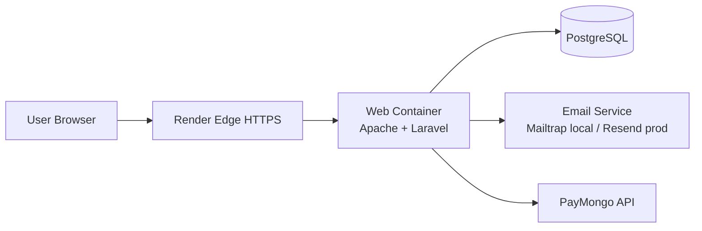

# Network Model Used (Simple)

## Model in Use

CTOMS uses a **hybrid cloud client-server model**:

- Local development: XAMPP + Laravel + MySQL
- Production: Render container + Laravel + PostgreSQL
- Shared external services: payment gateway and email provider

This is called "hybrid" because one app runs across two infrastructure environments while keeping the same business flow.

## High-Level Topology

## Request Flow (Simple)

1. Browser sends HTTPS request to Render.
2. Render forwards request to the Laravel container.
3. Laravel processes routes/controllers and reads or writes database data.
4. Laravel returns JSON or Inertia page response to browser.
5. For specific actions, Laravel also calls external services (email, payments).

## Why This Model Fits CTOMS

- Keeps development simple on local machines.
- Supports cloud deployment without changing core app logic.
- Separates responsibilities clearly.
- Client role: UI and user interaction.
- Server role: business rules and security.
- Database role: persistent records.
- Third-party role: payment and transactional email.

## Security Notes

- Production traffic is HTTPS.
- App uses environment variables for service credentials.
- Auth/session handling is managed by Laravel and Sanctum.

## One-Line Summary

CTOMS runs on a hybrid client-server network model: local dev stack for building, Render cloud stack for live traffic, and external APIs for email and payments.
