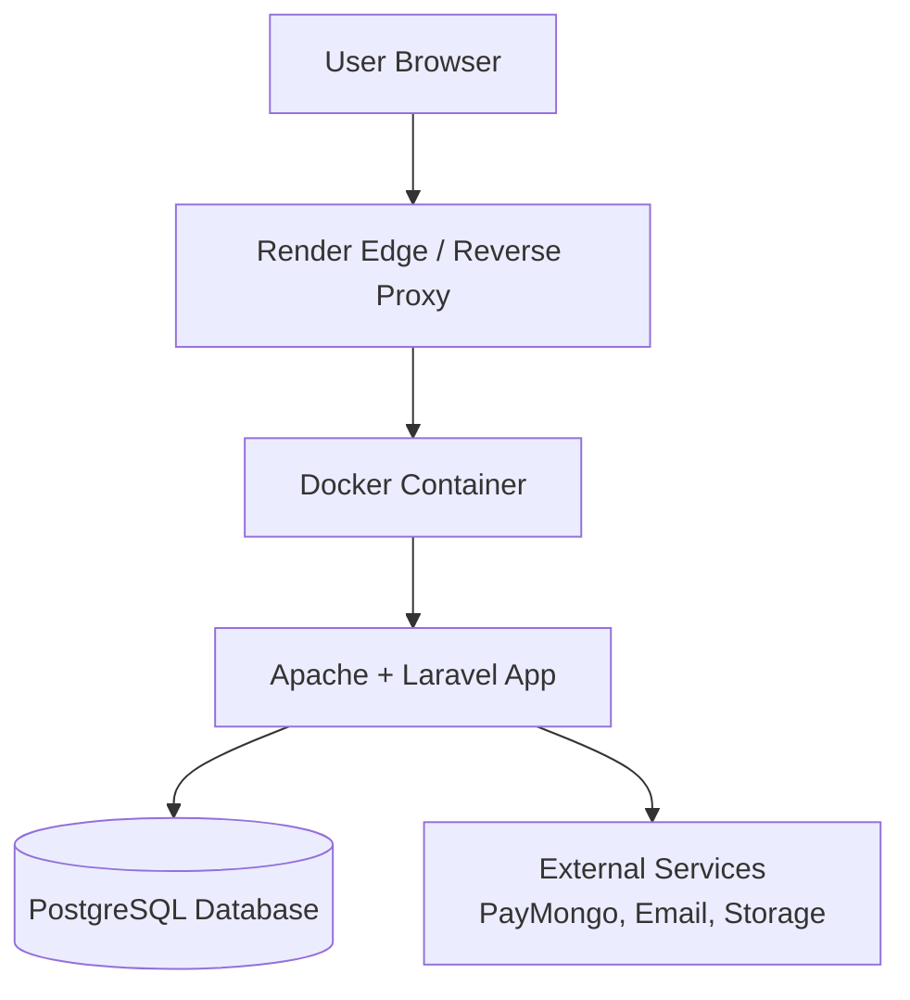

# Hybrid Topology (Simple Guide)

## What Is a Hybrid Topology?

A hybrid topology is when you combine two or more different network layouts into one setup.

Instead of using only one topology (like star, mesh, ring, or bus) across the whole network, a hybrid design lets you use each type where it fits best for different departments, floors, branches, or systems.

Date reference: Mar 8, 2026

## Why Use It?

- Flexibility: each area can use the layout that works best
- Scalability: easier to grow specific sections without redesigning everything
- Performance: critical areas can use faster or more reliable designs
- Reliability: failures in one section may not affect the entire network

## Example

A company can use:

- Star topology inside each office floor (easy device management)
- Mesh topology between data center routers (high redundancy)
- Bus or ring in legacy sections that are still in use

This combination creates one hybrid topology.

## Simple Deployment Topology

## Quick Summary

A hybrid topology combines multiple network topology types into one network architecture so each part of the organization can use the most appropriate design.
