# CTOMS-LR Network Model Diagram

## System Architecture Overview

Network model showing all user entities, their relationships, and cloud deployment topology.

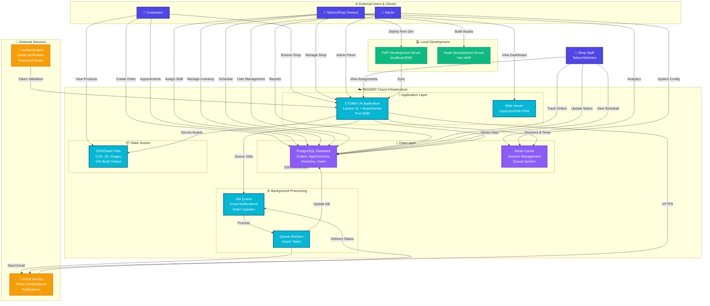

---

## Entity Relationship Model

### User Roles & Permissions

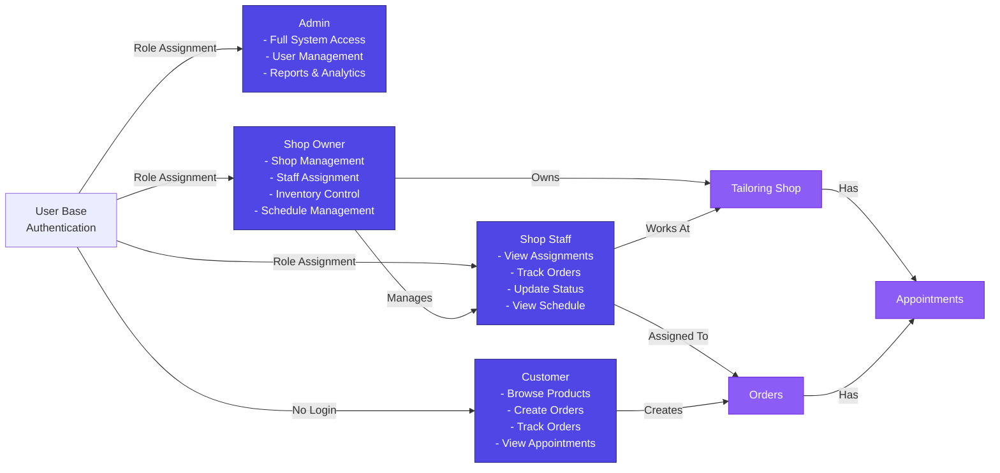

---

## Network Data Flow Diagram

### Request/Response Cycle

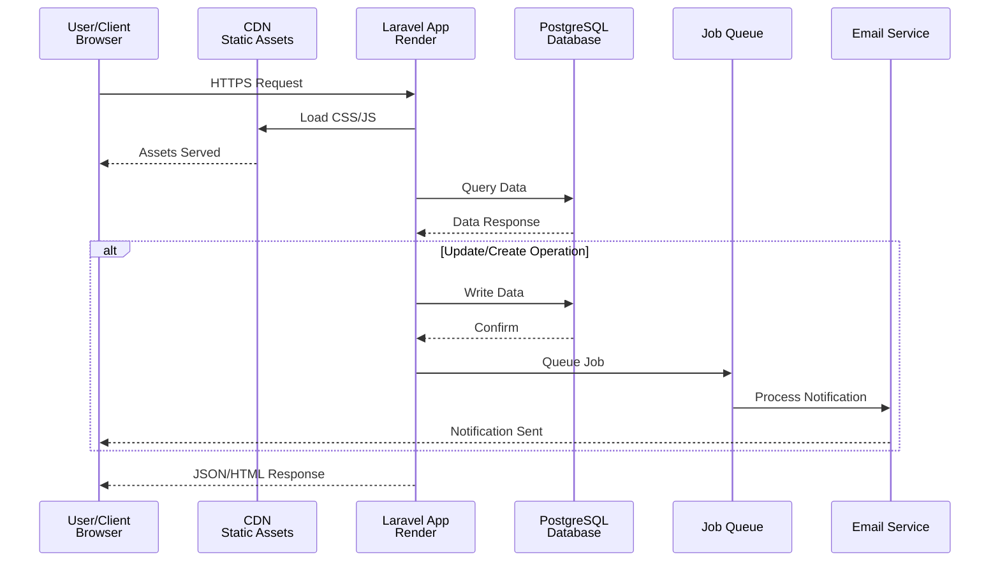

---

## Cloud Network Topology

### Render.com Deployment Structure

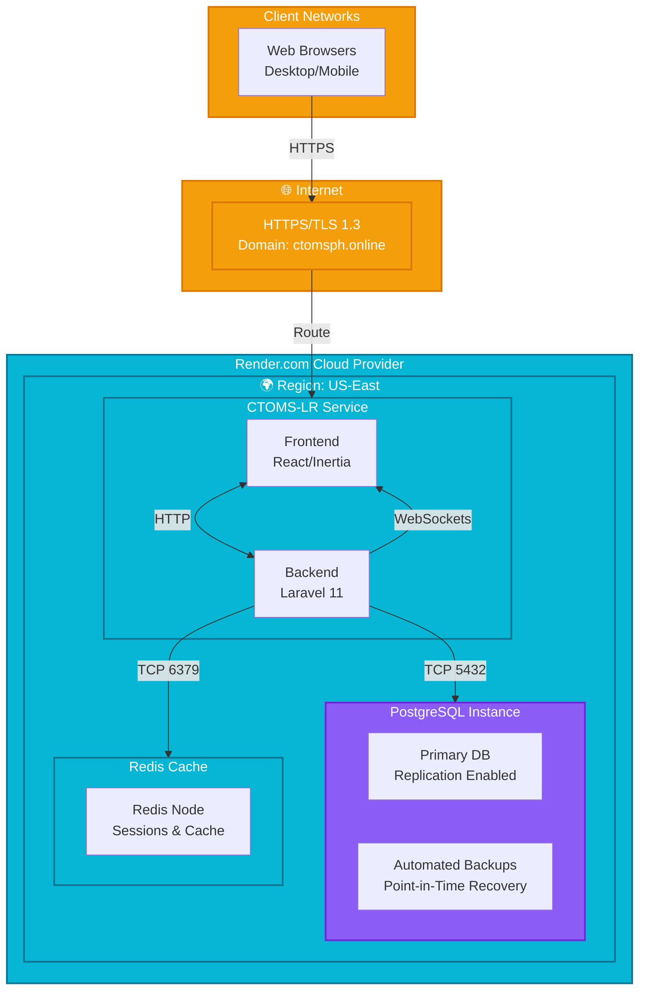

---

## Entity Interactions by Role

### Customer Journey

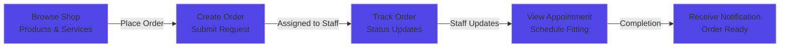

### Shop Owner Dashboard

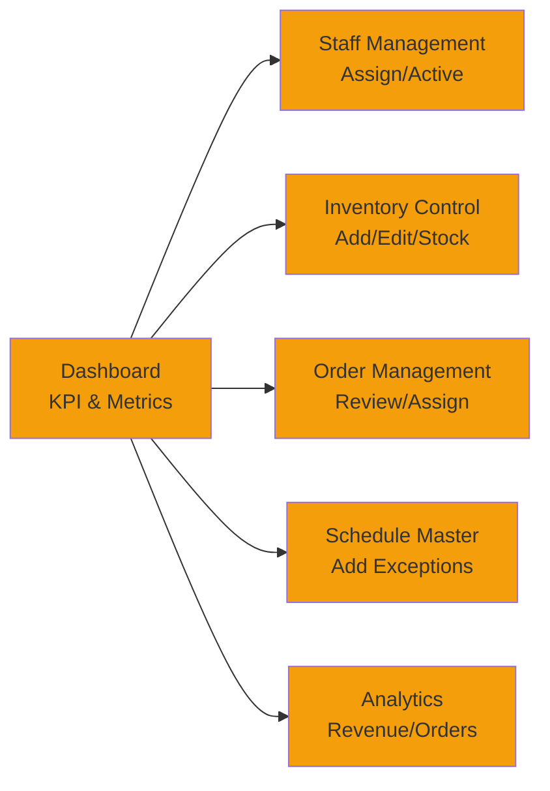

### Shop Staff Workflow

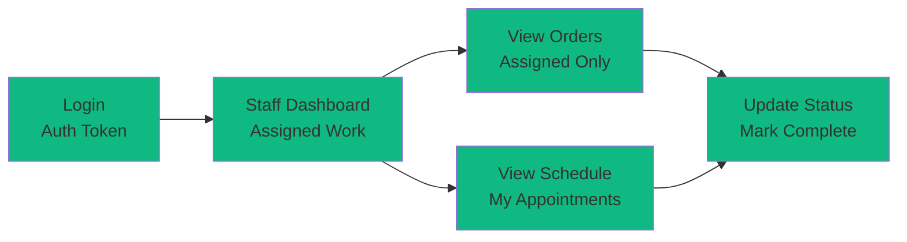

---

## Database Network Model

### Entity-Relationship Network

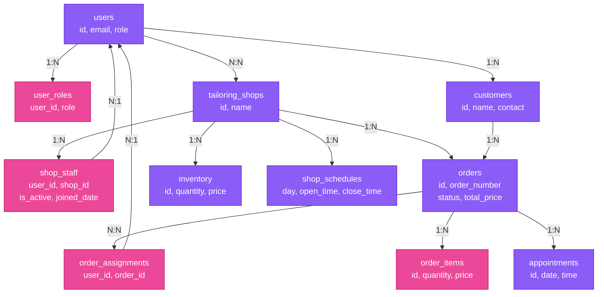

---

## Network Security & Communication

### HTTPS/TLS Encryption

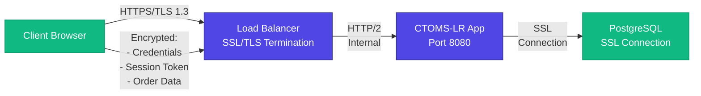

---

## Deployment Architecture

### Render.com Infrastructure

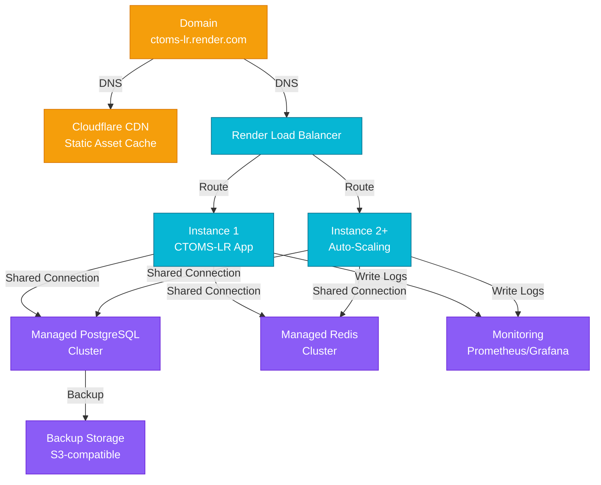

---

## API Gateway & Service Communication

### Internal Service Communication

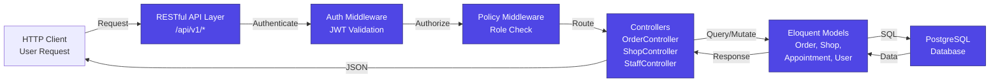

---

## Network Monitoring & Health

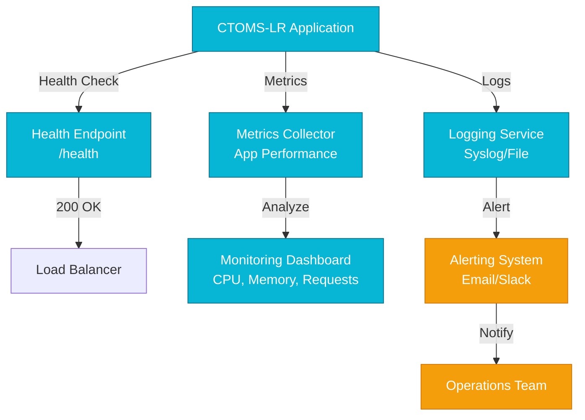

---

## Summary

| Component | Technology | Purpose |
|-----------|-----------|---------|
| **Hosting** | Render.com | Cloud platform for application |
| **Runtime** | PHP 8.2+ / Node.js | Application execution |
| **Frontend** | React 18 + Inertia.js + Vite | User interface |
| **Backend** | Laravel 11 | Business logic & APIs |
| **Database** | PostgreSQL | Persistent data storage |
| **Cache** | Redis | Session & cache layer |
| **Static Assets** | Render CDN | CSS, JS, Images |
| **Email** | SMTP Service | Notifications & alerts |
| **Security** | HTTPS/TLS 1.3 | Data encryption in transit |
| **Monitoring** | Render Logs | System health & errors |

---

## Key Network Features

✅ **Multi-tier Architecture** - Separation of frontend, backend, and database  
✅ **Role-Based Access** - Admin, Owner, Staff, Customer isolation  
✅ **Secure Communication** - TLS encryption for all network traffic  
✅ **Scalability** - Auto-scaling instances on Render  
✅ **Data Persistence** - PostgreSQL with automated backups  
✅ **Async Processing** - Background jobs via Redis queue  
✅ **Session Management** - Redis-based session storage  
✅ **CDN Distribution** - Static asset caching for performance  

---

**Last Updated:** May 15, 2026  
**Project:** CTOMS-LR (Custom Tailoring Order Management System - Laravel Refactor)  
**Deployment:** Render.com Cloud Platform
